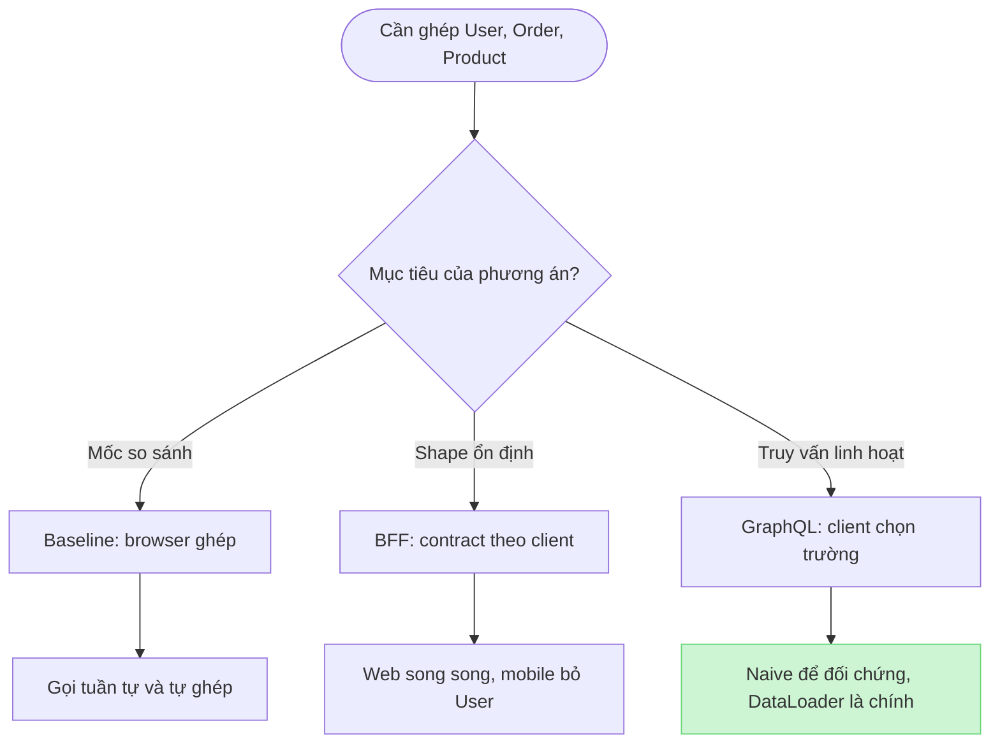
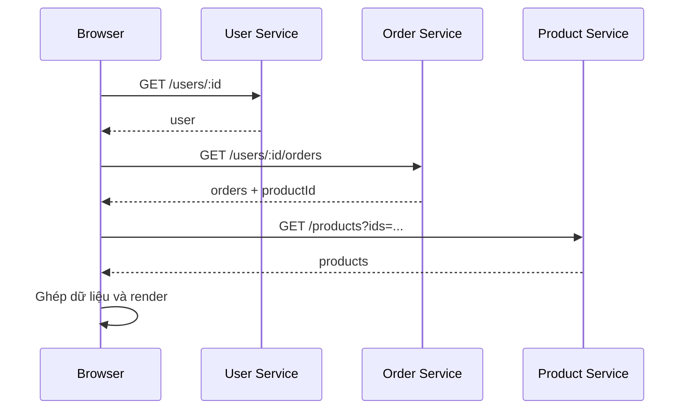
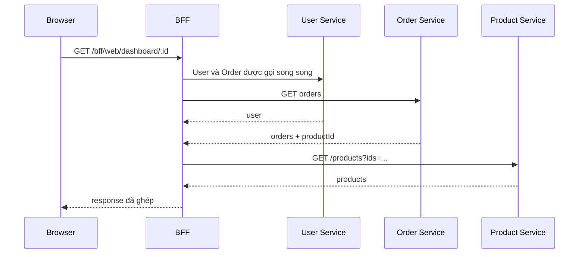
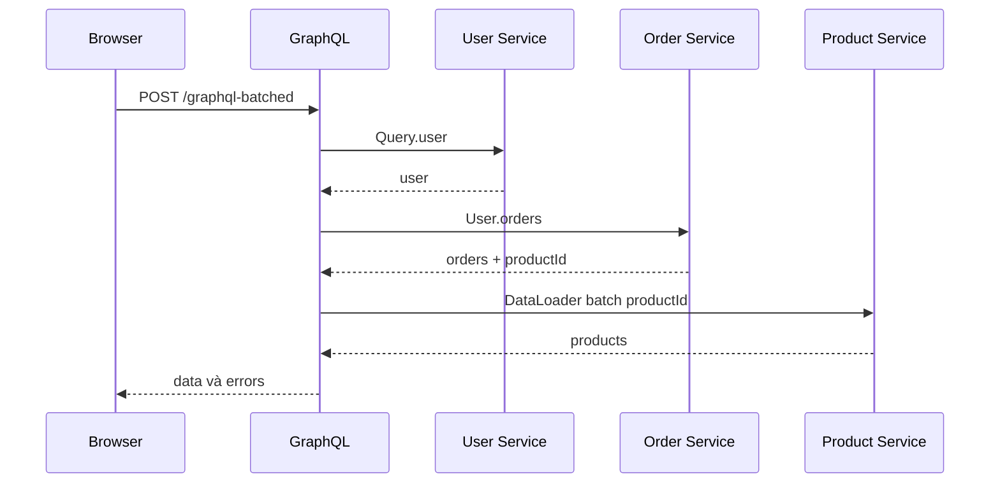

# BÁO CÁO QUYẾT ĐỊNH KỸ THUẬT — BLOCK 02

## API Composition: Baseline, BFF và GraphQL

> Báo cáo tập trung vào các quyết định khi thiết kế và hiện thực Block 2. Kết quả benchmark thực tế được tách khỏi tài liệu này.

## 1. Bối cảnh

Màn hình đơn hàng cần dữ liệu từ ba service độc lập:

- User Service: hồ sơ người dùng.
- Order Service: đơn hàng và các dòng hàng.
- Product Service: tên, giá và ảnh sản phẩm.

Block 2 giữ nguyên dữ liệu và giao diện, chỉ thay đổi nơi ghép dữ liệu. Ba phương án được hiện thực để làm rõ ba kiểu API composition:

| Phương án | Nơi ghép | Vai trò trong bài |
|---|---|---|
| Baseline | Browser | Mốc tham chiếu đơn giản, thể hiện chi phí ghép ở client |
| BFF | Server theo từng loại client | Tối ưu contract riêng cho web và mobile |
| GraphQL | Resolver trên server | Cho client chọn trường và làm rõ bài toán N+1 |

## 2. Sơ đồ quyết định

Sơ đồ cho thấy đây không phải lựa chọn một phương án “thắng tuyệt đối”. Mỗi phương án trả lời một nhu cầu khác nhau; các điều kiện dữ liệu, render, logging và lỗi được giữ thống nhất để việc so sánh công bằng.

## 3. Luồng request và response

Ba sơ đồ dưới đây cho thấy chính xác nơi dữ liệu được ghép. Mũi tên sang phải là request; mũi tên nét đứt là response.

### Baseline — browser tự ghép

### BFF — server trả đúng shape cho client

### GraphQL batched — resolver ghép theo field

Ở mobile, BFF và GraphQL dùng luồng Orders trực tiếp nên không gọi User Service.

## 4. Ma trận quyết định chính

| Chủ đề | Quyết định | Lý do | Đánh đổi chấp nhận |
|---|---|---|---|
| Nền tảng | Node.js 20+, Express 5, GraphQL Yoga | Một ngôn ngữ, phù hợp tác vụ I/O và dựng nhiều service nhanh | Không so sánh các runtime hoặc framework server |
| Dữ liệu | Mỗi service sở hữu một SQLite DB | Giữ ranh giới service, seed nhanh, đếm được SQL thật | Không đại diện hạ tầng production |
| Mô hình đơn hàng | `orders` 1–n `order_items`, liên kết Product bằng ID | Tạo tình huống composition và N+1 rõ ràng | Không có khóa ngoại xuyên service |
| Product API | Có endpoint batch, giới hạn 100 ID | BFF và DataLoader có thể deduplicate và gom request | Phía gọi phải chia chunk và map lại theo ID |
| BFF | Một endpoint cho web, một endpoint cho mobile | Mỗi client nhận đúng shape cần dùng; mobile không gọi User | Thêm service và tăng số contract cần duy trì |
| GraphQL | Hai query root và DataLoader mới cho từng request | Client chọn trường; batch và cache không rò giữa request | Phải kiểm soát N+1 và độ phức tạp query |
| Client | HTML, CSS, JavaScript thuần; dùng chung renderer | Tách ảnh hưởng của UI framework khỏi bài toán composition | Phải tự quản lý DOM và adapter |
| Quan sát | `rid`, JSON Lines và `AsyncLocalStorage` | Nối browser request, service call và DB query theo một luồng | Logging tự xây chỉ phù hợp phạm vi bài tập |
| Đo lường | Playwright, context mới, cùng mốc `screen-complete` | Đo cùng điều kiện và bao gồm hành vi browser | Không mô phỏng tải đồng thời hoặc production |
| Xử lý lỗi | Product lỗi trả partial; User/Order lỗi toàn màn hình | Giữ phần đơn hàng còn hữu ích, không tạo dữ liệu Product giả | Client phải xử lý `product: null`; HTTP 200 cần marker riêng |

## 5. Quyết định cho từng phương án composition

### Baseline

Browser gọi tuần tự User → Order → Product batch rồi tự ghép model. Dù User và Order có thể gọi song song, luồng tuần tự được giữ có chủ đích để làm mốc so sánh và thể hiện chi phí khi logic composition nằm ở client.

### BFF

- Web dùng `GET /bff/web/dashboard/:userId`; User và Order được gọi song song, sau đó Product được batch.
- Mobile dùng `GET /bff/mobile/orders/:userId`; không gọi User và chỉ trả trường cần hiển thị.

Quyết định này ưu tiên contract rõ ràng cho từng client. Đổi lại, thêm loại client có thể làm tăng số endpoint và logic mapping.

### GraphQL

- `user(id)` phục vụ web; `ordersByUser(userId)` phục vụ mobile mà không cần gọi User Service.
- `POST /graphql-naive` giữ lại để minh họa N+1.
- `POST /graphql-batched` dùng DataLoader tạo mới cho mỗi request, batch và deduplicate Product ID.

Resolver không truy vấn SQLite trực tiếp. `Query.user` gọi User Service, `User.orders` và `Query.ordersByUser` gọi Order Service; chỉ `OrderItem.product` gọi Product Service. Vì resolver field này chạy cho từng dòng hàng, bản naive tạo tối đa `M` HTTP call Product cho `M` item — đó là N+1 ở lớp API composition.

Ở bản batched, mọi lời gọi `load(productId)` trong cùng request được DataLoader gom vào một batch. Key trùng nhau được deduplicate và cache trong đúng request đó. Batch tiếp tục chia tối đa 100 ID cho mỗi Product request, sau đó đưa kết quả vào `Map` theo ID vì không được giả định thứ tự response giống thứ tự input. Cache không dùng chung giữa các HTTP request nên không rò dữ liệu hoặc làm sai phép đo.

## 6. Xử lý lỗi và ranh giới

### Chính sách lỗi

- Mọi call nội bộ timeout sau 1000 ms và không retry.
- Product lỗi hoặc timeout: giữ User và Order, đặt `product: null`, trả lỗi có `path`; BFF thêm `X-Partial-Response`.
- User hoặc Order lỗi: thất bại toàn màn hình vì thiếu dữ liệu cốt lõi.
- Không điền tên, giá hoặc ảnh giả khi Product lỗi.

Partial response được chọn vì thông tin đơn hàng vẫn hữu ích khi Product tạm thời không sẵn sàng. Đổi lại, client phải xử lý `null` và monitoring không thể chỉ dựa vào HTTP status.

| Cách trả partial | BFF | GraphQL |
|---|---|---|
| HTTP | `200` và header `X-Partial-Response` | Thường là `200` theo GraphQL over HTTP |
| Body | Dữ liệu đã ghép kèm `errors[]` | `data` đi cùng `errors[]` |
| Vị trí lỗi | `path` tự xây tới item | `path` do GraphQL gắn tới field resolver |
| Product | `product: null` | Field nullable trả `null` |

User hoặc Order vẫn là dữ liệu cốt lõi: lỗi ở hai service này làm hỏng toàn bộ màn hình ở cả hai phương án.

### Ranh giới dữ liệu và bảo vệ GraphQL

Mỗi service sở hữu một file SQLite riêng. Vì vậy BFF và GraphQL không thể join trực tiếp bảng User, Order và Product; chúng bắt buộc ghép qua HTTP. Quyết định này thể hiện đúng ranh giới service, nhưng tăng số lần gọi mạng so với một monolith dùng chung DB.

Query GraphQL lồng sâu hoặc lặp nhiều field có thể khuếch đại số resolver, lượng dữ liệu và CPU dù DataLoader đã giảm Product call. Client hiện chỉ dùng query cố định; nếu public API cần bổ sung giới hạn depth/complexity, pagination, rate limit và operation allowlist hoặc persisted query.

## 7. Phương án không chọn và phạm vi chấp nhận

| Phương án | Vì sao không chọn cho Block 2 |
|---|---|
| PostgreSQL | Tăng chi phí cài đặt; SQLite đã đủ để có DB query thật và tách dữ liệu theo service |
| JSON hoặc in-memory store | Đơn giản nhưng không thể hiện chi phí truy vấn DB |
| React hoặc Vue | UI chỉ phục vụ composition; framework có thể làm nhiễu việc so sánh |
| Cache Product toàn cục | Có nguy cơ dữ liệu cũ, rò phạm vi người dùng và làm sai điều kiện warm |
| Fail-fast khi Product lỗi | Làm mất toàn bộ đơn hàng dù dữ liệu chính vẫn còn hữu ích |
| Distributed tracing đầy đủ | Quá nặng cho bài chạy cục bộ; `rid` và JSON Lines đã đáp ứng nhu cầu truy vết |

Các nội dung nằm ngoài phạm vi: authentication, pagination, concurrent load, triển khai nhiều máy và bảo vệ GraphQL bằng depth/complexity limit. Giá Product lấy từ catalog hiện tại để phục vụ thí nghiệm; hệ thống bán hàng thật nên lưu snapshot giá tại thời điểm mua.

## 8. Kết luận

- Chọn **Baseline** khi cần một mốc tham chiếu đơn giản và muốn nhìn rõ chi phí ghép tại browser.
- Chọn **BFF** khi web/mobile có contract ổn định và cần kiểm soát response chặt.
- Chọn **GraphQL + DataLoader** khi client cần chọn trường linh hoạt và dữ liệu có quan hệ dễ phát sinh N+1.

Block 2 không cố chứng minh một công nghệ luôn tốt hơn. Quyết định quan trọng nhất là đặt composition đúng chỗ, giữ phép so sánh công bằng và làm rõ trade-off về contract, số call, khả năng quan sát và xử lý lỗi.

Báo cáo này là nguồn giải thích tập trung cho các quyết định của Block 2. Cách chạy project nằm trong [`README.md`](README.md).
