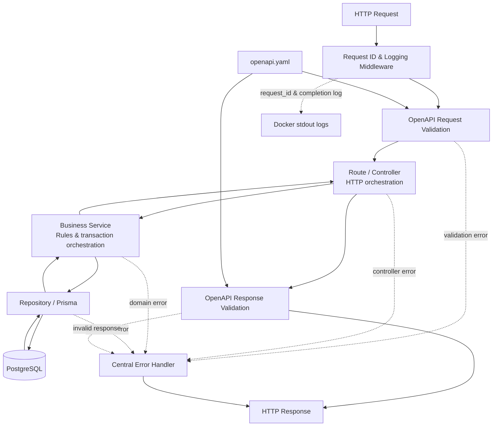

# BÁO CÁO QUYẾT ĐỊNH KỸ THUẬT - CONTRACT-FIRST CART API

## 1. Tổng quan

Nhóm xây dựng một RESTful Cart API cho phép xem sản phẩm đang bán, tạo và đọc giỏ hàng, thêm sản phẩm, cập nhật số lượng và xóa sản phẩm khỏi giỏ. Hệ thống không triển khai đăng nhập, checkout hay thanh toán vì các chức năng này nằm ngoài phạm vi bài.

Mục tiêu chính không chỉ là tạo đủ sáu endpoint mà còn bảo đảm:

- API có contract rõ ràng để client sử dụng mà không cần đọc source code.
- Request sai bị chặn trước khi đi vào business logic hoặc database.
- Response thực tế luôn khớp OpenAPI.
- Lỗi có format thống nhất, có `request_id` để đối chiếu với log.
- Database có migration, seed và lệnh reset để mọi thành viên có thể tạo lại cùng một bộ dữ liệu mẫu.
- Toàn bộ hệ thống có thể build và chạy bằng Docker Compose.
- Các kịch bản nghiệm thu được kiểm chứng tự động bằng Jest và Supertest.

## 2. Tổng hợp các lựa chọn công nghệ của nhóm

Toàn bộ technology stack dưới đây là quyết định chủ động của nhóm. Nhóm lựa chọn từng công nghệ dựa trên mức độ phù hợp với REST API, khả năng giữ một nguồn contract, tính toàn vẹn dữ liệu, khả năng kiểm thử và chi phí vận hành.

| Hạng mục | Quyết định | Lý do chính |
| --- | --- | --- |
| Nền tảng và web framework | Node.js 20+, Express.js 5 | Một ngôn ngữ xuyên suốt, middleware đơn giản, hệ sinh thái phù hợp REST API |
| Database | PostgreSQL 16 | Quan hệ và constraint mạnh, transaction đáng tin cậy |
| ORM | Prisma | Schema rõ, migration có lịch sử và có thể áp dụng giống nhau trên các môi trường |
| API contract | OpenAPI 3.1, contract-first | Một nguồn sự thật cho tài liệu và validation |
| Validation | `express-openapi-validator` | Validate trực tiếp từ OpenAPI, tránh schema trùng lặp |
| Documentation UI | Swagger UI qua `swagger-ui-express` | Hiển thị và thử API trực tiếp từ contract |
| Logging | Pino và `pino-http` | Log JSON có cấu trúc, chi phí xử lý thấp và gắn được thông tin request |
| Testing | Jest và Supertest | Kiểm thử tự động qua HTTP, dễ chạy trong CI |
| Đóng gói và vận hành | Docker multi-stage và Docker Compose | Mọi thành viên dùng cùng phiên bản và cùng quy trình khởi động |
| Log retention | Docker `local` driver, 10 MB x 5 file/container | Rotation đơn giản, tránh đầy ổ đĩa |
| Kiến trúc source code | Route - service - repository - infrastructure | Quyết định của nhóm |

## 3. Node.js và Express.js

### Lý do sử dụng

Node.js phù hợp với REST API thiên về I/O như Cart API: phần lớn thời gian request dành cho network và PostgreSQL thay vì tính toán CPU nặng. JavaScript được sử dụng xuyên suốt, giúp giảm chi phí chuyển đổi ngôn ngữ giữa code ứng dụng, test và script seed.

Express.js được chọn làm HTTP framework vì:

- Middleware model đơn giản, phù hợp để thể hiện rõ thứ tự `request ID -> logging -> JSON parsing -> OpenAPI validation -> routes -> error handler`.
- Hệ sinh thái ổn định và tích hợp trực tiếp với `pino-http`, `swagger-ui-express` và `express-openapi-validator`.
- Dễ dependency injection thủ công trong test: `createApp({ repository, logger })` cho phép thay database hoặc logger mà không cần DI framework.
- Quy mô sáu endpoint chưa cần một framework nhiều abstraction.

### Vì sao không chọn phương án khác

- **Spring Boot:** mạnh về dependency injection, annotation và enterprise tooling, nhưng nhóm ưu tiên JavaScript xuyên suốt và ít boilerplate hơn cho một API nhỏ.
- **NestJS:** có module, decorator và DI container tốt khi hệ thống lớn, nhưng thêm một lớp framework và conventions chưa cần thiết cho phạm vi hiện tại.
- **Fastify:** có hiệu năng và schema integration tốt, nhưng bài yêu cầu Express và hệ thống không có tải đủ lớn để hiệu năng framework là nút thắt.
- **Node `http` thuần:** ít dependency nhưng phải tự xây routing, middleware, error handling và integration, làm tăng code không liên quan tới nghiệp vụ.

### Điểm đánh đổi

Express không ép buộc kiến trúc, nên nhóm phải chủ động tách route, service, repository, error và infrastructure. Đây là lý do source code được tổ chức theo trách nhiệm thay vì đặt toàn bộ logic trong route handler.

## 4. Contract-first với OpenAPI 3.1

### Lý do sử dụng

Nhóm chọn contract-first: định nghĩa `openapi.yaml` trước, sau đó code và test phải tuân theo contract này. File `openapi.yaml` là nguồn duy nhất cho:

1. Tài liệu tương tác tại `/docs`.
2. Validation request trước handler.
3. Validation response sau handler.
4. Ví dụ payload, status code và error schema cho người dùng API.

Cách này giảm nguy cơ tài liệu mô tả một kiểu nhưng API thực tế trả về một kiểu khác. Khi schema thay đổi, validator và Swagger UI cùng đọc một file nên sai lệch được phát hiện sớm.

### Vì sao dùng Swagger UI

Swagger UI render trực tiếp OpenAPI hiện có, cho phép người dùng:

- Xem đủ method, path, parameter, request body và response.
- Gửi request thử ngay trên trình duyệt.
- Quan sát lỗi validation và `X-Request-Id` trong demo.

### Vì sao không chọn phương án khác

- **Tài liệu Markdown viết tay:** dễ đọc nhưng không machine-readable và dễ lệch code.
- **Postman Collection làm nguồn chính:** tốt cho thử request nhưng không nên trở thành schema thứ hai song song với OpenAPI.
- **Code-first sinh OpenAPI từ annotation:** thuận tiện ở một số framework nhưng làm contract phụ thuộc implementation; không phù hợp mục tiêu contract-first của bài.
- **Redoc/Scalar:** giao diện đọc tài liệu tốt, nhưng Swagger UI đáp ứng đủ nhu cầu và có khả năng thử request trực tiếp với integration đơn giản hơn trong project hiện tại.

## 5. Kiểm tra dữ liệu ngay khi tiếp nhận request

Nhóm sử dụng `express-openapi-validator` và cấu hình:

- Không tự chuyển kiểu (`coerceTypes: false`), vì `quantity: "2"` phải bị từ chối.
- Không tự xóa field lạ (`removeAdditional: false`).
- Không chấp nhận query parameter ngoài contract.
- Validate cả request và response.

Validator được đặt trước routes, service và repository. Vì vậy request sai schema không thể chạm database.

### Vì sao không dùng Joi, Zod hoặc validation thủ công

Joi và Zod đều là lựa chọn tốt, nhưng nếu dùng thêm sẽ tạo hai nguồn schema: một trong `openapi.yaml` và một trong code. Hai schema có thể khác nhau theo thời gian. Validation thủ công bằng `if` cũng dễ thiếu case và khó đồng bộ với documentation.

Nhóm chỉ viết code riêng cho các quy tắc cần dữ liệu thực tế, ví dụ cart có mở hay không, sản phẩm còn bán hay đủ tồn kho hay không. Kiểu dữ liệu, UUID, giới hạn và field lạ được kiểm tra ngay khi API tiếp nhận request.

## 6. PostgreSQL và Prisma

### Lý do chọn PostgreSQL

Mô hình Cart có quan hệ rõ ràng giữa `products`, `carts` và `cart_items`. PostgreSQL phù hợp vì:

- Hỗ trợ khóa chính UUID, unique constraint và foreign key.
- Có `CHECK` constraint cho giá, tồn kho, trạng thái và quantity.
- Hỗ trợ transaction cho chuỗi kiểm tra business rule và mutation.
- Bảo đảm tính toàn vẹn tốt hơn việc chỉ kiểm tra ở application.

### Lý do dùng Prisma

Prisma cung cấp:

- Schema mapping rõ giữa JavaScript và tên cột SQL.
- Migration có lịch sử và có thể deploy lại.
- Client có API nhất quán cho query và transaction.
- Seed/reset giúp mọi thành viên tạo lại cùng dữ liệu mẫu trước khi kiểm thử.
- Repository có thể nhận Prisma client hoặc transaction client, giúp giữ mutation trong một transaction.

### Vì sao không chọn phương án khác

- **MongoDB:** linh hoạt về document nhưng quan hệ Cart/Product và constraint trong bài phù hợp relational database hơn.
- **Raw SQL:** kiểm soát tốt nhưng tăng code mapping, transaction boilerplate và nguy cơ lỗi khi xây query động.
- **Sequelize/TypeORM:** đều dùng được, nhưng nhóm đánh giá Prisma có schema và migration workflow gọn hơn cho project này.
- **SQLite:** thuận tiện cho demo nhưng không đại diện đúng yêu cầu PostgreSQL và khác hành vi constraint/concurrency của môi trường đích.

### Quyết định dữ liệu

- Giá luôn đọc từ database; client không được gửi giá.
- `subtotal_cents` dùng integer arithmetic để tránh sai số floating point.
- `cart_items` có composite primary key `(cart_id, product_id)` để một sản phẩm không xuất hiện hai lần trong cùng cart.
- Thêm hoặc sửa item kiểm tra stock nhưng không trừ hay giữ chỗ tồn kho; inventory reservation thuộc phạm vi checkout và chưa được triển khai.

### Seed fixtures và mục đích kiểm thử

Seed không tạo dữ liệu ngẫu nhiên. UUID, SKU, giá, stock và trạng thái được cố định để mọi lần reset database đều tạo ra cùng đầu vào cho acceptance tests.

| Fixture | Trạng thái | Giá/stock | Mục đích |
| --- | --- | --- | --- |
| Mechanical Keyboard (`KEYBOARD-001`) | Active, còn hàng | 129900 cents; stock 8 | Happy path cho add/update/delete; kết hợp với Mouse để kiểm tra subtotal từ giá database. |
| Wireless Mouse (`MOUSE-001`) | Active, còn hàng | 59900 cents; stock 4 | Dùng quantity 5 để tạo `INSUFFICIENT_STOCK` trong khi request vẫn hợp schema 1-10; cũng tham gia test subtotal. |
| 27-inch Monitor (`MONITOR-001`) | Active, còn hàng | 349900 cents; stock 6 | Bảo đảm seed có đủ ba sản phẩm active còn hàng và kiểm tra danh sách/sắp xếp sản phẩm. |
| USB Headset (`HEADSET-001`) | Active, hết hàng | 89900 cents; stock 0 | Chứng minh “active” và “còn hàng” là hai trạng thái khác nhau: sản phẩm vẫn xuất hiện trong danh sách nhưng không thể thêm với quantity dương. |
| Legacy Webcam (`WEBCAM-OLD`) | Inactive, còn stock | 49900 cents; stock 5 | Phải bị loại khỏi `GET /products`; nếu tham chiếu khi add item thì trả `PRODUCT_UNAVAILABLE`. |
| Cart `20000000-0000-4000-8000-000000000001` | `checked_out` | Không có item | Dùng để kiểm tra mọi mutation trên cart đã đóng trả `CART_CLOSED`. |

Ba trạng thái sản phẩm được bao phủ rõ: **3 active còn hàng, 1 active hết hàng và 1 inactive**. Trước mỗi acceptance test, seed xóa cart items, carts và products cũ rồi tạo lại bộ fixture này. Nhờ đó kết quả test không phụ thuộc test chạy trước đó.

## 7. Error contract và request ID

Tất cả lỗi được chuẩn hóa thành:

```json
{
  "code": "VALIDATION_ERROR",
  "message": "Request is invalid",
  "details": [],
  "request_id": "uuid"
}
```

Nhóm tách:

- `AppError`: lỗi ứng dụng có status và stable error code.
- `cartErrors`: factory cho các lỗi nghiệp vụ Cart.
- `errorHandler`: chuyển validator error, domain error và unexpected error về cùng contract.

Mỗi request được cấp UUID. Giá trị này xuất hiện trong `X-Request-Id`, error body và log JSON, giúp truy vết một request mà không để lộ exception, stack trace hay SQL cho client.

## 8. Logging: Pino, pino-http và Docker

### Lựa chọn cuối cùng

Nhóm sử dụng Pino và `pino-http` để ghi log JSON có cấu trúc. Mỗi request log có method, URL, status, thời gian xử lý và `request_id`. Logger che giá trị của `Authorization`, cookie, password, token và secret. Pino ghi log ra stdout, sau đó Docker lưu lại, giới hạn dung lượng và tự xoay vòng các file log phía dưới.

Trong Docker, ứng dụng chỉ ghi ra stdout. Docker Compose dùng logging driver `local` với:

```yaml
logging:
  driver: local
  options:
    max-size: "10m"
    max-file: "5"
```

Như vậy log mỗi container bị giới hạn khoảng 50 MB trước compression, tránh file tăng vô hạn. Log được xem bằng `docker compose logs` mà application không cần tự quản lý rotation.

### Vì sao chọn Pino

- Log JSON dễ tìm theo `request_id` và có thể đưa vào hệ thống quản lý log tập trung sau này.
- Overhead thấp, phù hợp Node.js event loop.
- `pino-http` tích hợp trực tiếp với lifecycle của request/response.
- Redaction có sẵn và cấu hình tập trung.

### Vì sao không chọn phương án khác

- **`console.log`:** chỉ ghi nội dung ra stdout và không tự cung cấp cơ chế lưu trữ. Khi chạy Node trực tiếp, log chỉ xuất hiện trên terminal và sẽ không còn để tra cứu sau khi đóng terminal nếu người dùng không chuyển output sang file hoặc một hệ thống thu thập log. Trong Docker, stdout vẫn có thể được Docker lưu lại, nhưng các dòng `console.log` thường không có level, `request_id`, định dạng thống nhất hoặc cơ chế che dữ liệu nhạy cảm, nên khó tìm đúng request gây lỗi và khó điều tra sự cố.
- **Morgan:** phù hợp access log cơ bản nhưng không phải application logger đầy đủ và không giải quyết domain/error logging.
- **Winston:** có nhiều cách chuyển và lưu log, nhưng cần cấu hình nhiều hơn; project ưu tiên JSON logging đơn giản và ít ảnh hưởng đến hiệu năng.
- **Ghi `api.log` không rotation:** dễ làm đầy ổ đĩa và ghi trùng với container log.
- **ELK Stack:** mạnh cho search, dashboard và nhiều service, nhưng cần Elasticsearch, Logstash/agent và Kibana; chi phí tài nguyên và vận hành quá lớn cho một Cart API đơn service. Kiến trúc stdout JSON hiện tại vẫn cho phép bổ sung ELK, Loki hoặc cloud logging sau này mà không sửa business code.

## 9. Docker và quy trình migration

Nhóm dùng multi-stage Dockerfile:

- Stage `build` cài đầy đủ dependency và sinh Prisma Client.
- Image chạy API chỉ giữ dependency cần cho production và sử dụng user `node` thay vì root.
- `.dockerignore` loại `.env`, log, Git metadata và `node_modules` khỏi build context.

Docker Compose có ba service:

```text
postgres --healthy--> migrate --completed successfully--> api
```

`migrate` là service chạy một lần để thực thi `prisma migrate deploy`, sau đó thoát với code 0. API chỉ khởi động khi migration thành công. Cách này tránh để API nhận request khi database chưa có schema và không buộc image chạy API phải chứa Prisma CLI.

Seed được chạy chủ động bằng một one-off container riêng. Nhóm không tự seed mỗi lần production start vì seed là dữ liệu demo/test, không phải startup behavior của ứng dụng.

### Vì sao không cài trực tiếp trên máy

Chạy Node và PostgreSQL trực tiếp vẫn được, nhưng phiên bản phần mềm có thể khác nhau giữa các thành viên. Docker Compose thống nhất môi trường, network, thứ tự khởi động và chính sách lưu log, nên mọi người có thể cài đặt và chạy project theo cùng một quy trình.

### Điểm đánh đổi

Docker làm tăng thời gian build lần đầu và cần Docker Desktop/Engine. One-shot migration phù hợp local/demo; ở production lớn, migration thường được chuyển thành một deployment job trong CI/CD trước rollout.

## 10. Kiến trúc hệ thống và source code

### 10.1. Sơ đồ thành phần và request lifecycle



Luồng chính đi từ trên xuống khi nhận request và đi ngược lên khi trả response. `openapi.yaml` được dùng ở cả hai đầu: kiểm tra request trước route và kiểm tra response trước khi gửi cho client. Nếu bất kỳ bước nào phát sinh lỗi, central error handler chuyển lỗi đó về cùng cấu trúc `{ code, message, details, request_id }`.

### 10.2. Trách nhiệm từng thành phần

| Thành phần | Trách nhiệm | Không chịu trách nhiệm |
| --- | --- | --- |
| `server.js` | Khởi động HTTP server, xử lý SIGINT/SIGTERM và đóng Prisma khi dừng. | Không chứa route hoặc business rule. |
| `app.js` | Ghép các middleware và dependency theo đúng thứ tự. | Không trực tiếp query database. |
| Request ID & logging middleware | Sinh UUID, đặt `X-Request-Id`, gắn ID vào log và ghi kết quả request. | Không quyết định status/business error. |
| OpenAPI validator | Kiểm tra path, query, body và response theo `openapi.yaml`. | Không kiểm tra product/cart đang có trong database. |
| Route/controller | Đọc `req`, gọi service, đặt status/header và gửi response. | Không chứa Prisma query hoặc quy tắc tồn kho. |
| Business service | Kiểm tra cart, product, stock, item trùng; điều phối transaction; tính response model. | Không phụ thuộc Express hoặc chi tiết HTTP. |
| Repository | Thực hiện Prisma query và cung cấp transaction boundary. | Không chọn HTTP status hay tạo response body. |
| Prisma/PostgreSQL | Lưu dữ liệu, foreign key, unique/check constraints và atomic transaction. | Không biết request ID hoặc API error format. |
| Central error handler | Chuyển validation, domain và unexpected errors về một error contract; không lộ stack/SQL/secret. | Không sửa hoặc tiếp tục business operation đã lỗi. |
| Response validation | So response thật với OpenAPI trước khi gửi. | Không thay đổi response để “ép” nó khớp schema. |

### 10.3. Chiều phụ thuộc

Dependency đi theo một chiều:

```text
route -> service -> repository -> Prisma -> PostgreSQL
```

Route biết service, nhưng service không biết Express route. Service biết interface hành vi của repository, nhưng repository không biết HTTP status hay response header. `app.js` là nơi khởi tạo và nối các thành phần. Cách tổ chức này giúp thay repository bằng test double khi kiểm tra validation/logging và giảm ảnh hưởng khi một layer thay đổi.

Logging, request ID, OpenAPI validation và error handling là các chức năng dùng chung cho mọi endpoint. Chúng được đặt trong middleware pipeline thay vì lặp lại trong từng route. Logging bao quanh toàn bộ request lifecycle; validation đứng trước business code; error handler đứng cuối để nhận lỗi từ validator, controller, service, repository và response validation.

### 10.4. Cấu trúc source code

Cây thư mục cho biết vị trí implementation của các thành phần trên:

```text
src/
├── app.js                    # composition và middleware order
├── server.js                 # process lifecycle
├── config/logger.js          # logging
├── database/prisma.js        # database client
├── errors/                   # base error và domain errors
├── routes/                   # HTTP handlers
├── middleware/               # error translation
├── services/                 # business rules
└── repositories/             # lớp truy cập database
```

Nhóm không dùng một DI framework vì constructor injection đơn giản đã đủ cho một service. Việc thêm framework DI lúc này tạo nhiều abstraction hơn giá trị mang lại.

## 11. Ma trận đối chiếu yêu cầu với implementation

### 11.1. Sáu endpoint

| Endpoint | Request contract | Success response | Business/error rules | Nơi implement |
| --- | --- | --- | --- | --- |
| `GET /products` | Query `limit`: integer 1-50, mặc định 20. `offset`: integer >= 0, mặc định 0. | `200 ProductList`; chỉ trả product active, sắp theo SKU. | `400 VALIDATION_ERROR`, `500 INTERNAL_SERVER_ERROR`. | `productRoutes.js` -> `CartService.listProducts` -> `CartRepository.listProducts` |
| `POST /carts` | Không có request body. | `201 Cart`; header `Location: /carts/{id}`. | `500 INTERNAL_SERVER_ERROR`. | `cartRoutes.js` -> `CartService.createCart` -> `CartRepository.createCart` |
| `GET /carts/{cartId}` | `cartId` phải là UUID. | `200 Cart` gồm items và `subtotal_cents`. | `400 VALIDATION_ERROR`, `404 CART_NOT_FOUND`, `500 INTERNAL_SERVER_ERROR`. | `cartRoutes.js` -> `CartService.getCart` -> `CartRepository.findCart` |
| `POST /carts/{cartId}/items` | `AddItemRequest`: bắt buộc `product_id` UUID và `quantity` integer 1-10; không cho field lạ. | `201 Cart` sau khi thêm item. | `400 VALIDATION_ERROR`, `404 CART_NOT_FOUND`, `409 CART_CLOSED`, `409 ITEM_ALREADY_IN_CART`, `409 INSUFFICIENT_STOCK`, `422 PRODUCT_UNAVAILABLE`, `500`. | `cartRoutes.js` -> `CartService.addItem` -> repository transaction |
| `PATCH /carts/{cartId}/items/{productId}` | Hai path ID là UUID. `UpdateItemRequest`: bắt buộc `quantity` integer 1-10; không cho field lạ. | `200 Cart` với quantity và subtotal mới. | `400 VALIDATION_ERROR`, `404 CART_NOT_FOUND`, `404 ITEM_NOT_FOUND`, `409 CART_CLOSED`, `409 INSUFFICIENT_STOCK`, `422 PRODUCT_UNAVAILABLE`, `500`. | `cartRoutes.js` -> `CartService.updateItem` -> repository transaction |
| `DELETE /carts/{cartId}/items/{productId}` | Hai path ID là UUID; không có body. | `204`, không có response body. | `400 VALIDATION_ERROR`, `404 CART_NOT_FOUND`, `404 ITEM_NOT_FOUND`, `409 CART_CLOSED`, `500`. | `cartRoutes.js` -> `CartService.deleteItem` -> repository transaction |

`express-openapi-validator` chạy trước router. Vì vậy các lỗi kiểu dữ liệu, UUID, field thiếu hoặc field lạ được trả về trước khi service/repository được gọi. Response validation cũng dùng chính `openapi.yaml`, không có schema thứ hai trong test.

### 11.2. Request và response schemas

| Schema | Field bắt buộc và giới hạn | Được sử dụng tại |
| --- | --- | --- |
| `AddItemRequest` | `product_id: uuid`, `quantity: integer 1-10`, `additionalProperties: false` | `POST /carts/{cartId}/items` |
| `UpdateItemRequest` | `quantity: integer 1-10`, `additionalProperties: false` | `PATCH /carts/{cartId}/items/{productId}` |
| `Product` | `id`, `sku`, `name`, `price_cents > 0`, `stock >= 0` | Phần tử trong `ProductList.items` |
| `ProductList` | `items`, `limit` 1-50, `offset >= 0` | Response của `GET /products` |
| `CartItem` | `product_id`, `sku`, `name`, `price_cents`, `quantity` 1-10, `line_total_cents` | Phần tử trong `Cart.items` |
| `Cart` | `id`, `status` (`open`/`checked_out`), `items`, `subtotal_cents >= 0` | Create/get/add/update cart responses |
| `Error` | `code`, `message`, `details`, `request_id`; không cho field lạ | Mọi response lỗi, kể cả 500 |

### 11.3. Business rules và error codes

| Quy tắc | Error khi vi phạm | Cách implementation kiểm tra |
| --- | --- | --- |
| Cart UUID phải tồn tại | `404 CART_NOT_FOUND` | `findCart`; `assertOpenCart` hoặc `getCart` tạo domain error |
| Chỉ được thay đổi cart đang `open` | `409 CART_CLOSED` | `assertOpenCart` chạy trước mutation |
| Product phải tồn tại và active | `422 PRODUCT_UNAVAILABLE` | `findProduct` và kiểm tra `isActive` |
| Quantity không vượt stock | `409 INSUFFICIENT_STOCK` | So sánh quantity với stock đọc từ database |
| Không thêm product đã có trong cart | `409 ITEM_ALREADY_IN_CART` | `findCartItem` trước `createCartItem` |
| Item cần update/delete phải tồn tại | `404 ITEM_NOT_FOUND` | `findCartItem` trước mutation |
| Giá và subtotal không tin dữ liệu client | Không nhận `price_cents` trong request | Giá đọc từ Product; line total và subtotal tính bằng integer cents |
| Lỗi validation không được truy cập database | `400 VALIDATION_ERROR` | OpenAPI middleware đứng trước router; test dùng repository spy xác nhận 0 call |
| Lỗi ngoài dự kiến không lộ nội bộ | `500 INTERNAL_SERVER_ERROR` | Error middleware chỉ log loại lỗi, không trả stack/SQL/secret |

## 12. Evidence và quy trình chạy lại

### 12.1. Lệnh chạy duy nhất

Điều kiện: đã chạy `npm ci`, có `.env`, và PostgreSQL container đang healthy.

```bash
npm run test:acceptance
```

Lệnh này thực hiện tuần tự:

```text
prisma migrate reset --force
        -> áp dụng migration
        -> chạy seed cố định
        -> Jest + Supertest chạy tuần tự
```

Kết quả ghi nhận ngày 01/10/2026:

```text
Database reset successful
The seed command has been executed.
PASS test/acceptance.test.js
PASS test/logger.test.js
Test Suites: 2 passed, 2 total
Tests:       26 passed, 26 total
```

### 12.2. Ma trận 26 test và yêu cầu được chứng minh

| Số test | Tên/kịch bản trong test | Yêu cầu được chứng minh |
| ---: | --- | --- |
| 1 | `serves Swagger UI from the API application` | `/docs` hoạt động và response có request ID. |
| 4 | List mặc định; `limit=0`; `limit=51`; pagination hợp lệ | `GET /products`, filter active, thứ tự ổn định, default/range pagination và validation 400. |
| 1 | `creates an empty cart with Location and the common cart schema` | `POST /carts` trả 201, Location và Cart rỗng đúng schema. |
| 3 | Invalid quantity `0`, `11`, `"2"` | 400; `details` chỉ ra `quantity`; chuỗi không được tự đổi thành số. |
| 2 | Thiếu `product_id`; body có field lạ | 400 và cart không thay đổi. |
| 1 | Valid but unknown cart UUID | `404 CART_NOT_FOUND`. |
| 1 | Add hai product rồi GET cart | Subtotal bằng phép tính tay từ giá đã lưu. |
| 1 | Inactive product | `422 PRODUCT_UNAVAILABLE`. |
| 1 | Quantity hợp schema nhưng lớn hơn stock | `409 INSUFFICIENT_STOCK`. |
| 1 | Mutation trên checked-out cart | `409 CART_CLOSED`. |
| 1 | Thêm cùng product hai lần | `409 ITEM_ALREADY_IN_CART`. |
| 1 | Update quantity thành công | PATCH trả 200, quantity và subtotal được cập nhật. |
| 1 | PATCH item không tồn tại | `404 ITEM_NOT_FOUND`. |
| 1 | Delete item thành công | `204`, response body rỗng, có request ID. |
| 1 | DELETE item không tồn tại | `404 ITEM_NOT_FOUND`. |
| 1 | Success response và log dùng cùng request ID | Header-log correlation. |
| 2 | cartId sai và body sai với repository spy | Validation chạy trước database; repository có 0 call. |
| 1 | Database outage | 500 đúng schema, không lộ stack, SQL, password, token hay Authorization. |
| 1 | Structured logger redaction | Log JSON có request ID và che Authorization/password. |
| **26** | **Tổng cộng** | **Hai bộ test đều đạt.** |

Ngoài assertions riêng ở trên, `validateResponses: true` chạy trong application khi test. Vì vậy response sai `openapi.yaml` sẽ làm test thất bại thay vì chỉ được kiểm tra bằng một schema viết lại trong test.

### 12.3. Vì sao không chỉ test bằng Postman

Postman hữu ích cho demo thủ công nhưng kết quả phụ thuộc thao tác người dùng và trạng thái database. Jest/Supertest tự reset/seed dữ liệu, chạy lại chính xác và có thể tích hợp vào CI. Swagger UI và curl được giữ cho demo trực quan, không thay thế bộ kiểm thử nghiệm thu tự động.

## 13. Phân tích các contract decision

Các quyết định dưới đây xử lý những điểm đề bài chưa quy định đầy đủ. Chúng được ghi trong `CONTRACT_DECISIONS.md` và trở thành contract chính thức của project qua `openapi.yaml`.

| Quyết định | Phương án đã cân nhắc | Lý do chọn | Điểm đánh đổi |
| --- | --- | --- | --- |
| `GET /products` trả `{ items, limit, offset }` | Trả mảng product trực tiếp; hoặc thêm cả `total` | Envelope cho client biết page đang áp dụng mà không cần query đếm tổng. | Payload dài hơn mảng trực tiếp; chưa có `total`, nên client chưa tính được tổng số trang. |
| `offset >= 0`, mặc định 0 | Không đặt giới hạn; hoặc cursor pagination | Offset dễ hiểu và đủ cho dữ liệu nhỏ; số âm không có ý nghĩa. | Offset lớn có thể chậm và kém ổn định khi dữ liệu thay đổi; cursor phù hợp hơn ở quy mô lớn. |
| Sắp product theo SKU tăng dần | Không sort; sort theo tên hoặc thời gian tạo | Kết quả ổn định để offset pagination và test không phụ thuộc thứ tự database. | SKU không nhất thiết là thứ tự hiển thị tốt nhất cho người mua. |
| Product active nhưng stock 0 vẫn xuất hiện | Ẩn mọi product hết hàng | Tách rõ “đang được bán” khỏi “tạm hết tồn kho”; thao tác thêm vẫn trả `INSUFFICIENT_STOCK`. | Client phải hiển thị trạng thái hết hàng thay vì giả định mọi item trong list đều thêm được. |
| `POST /carts` trả Cart đầy đủ và relative `Location` | Chỉ trả ID; body rỗng; hoặc absolute URL | Dùng một Cart schema cho mọi response và relative URL hoạt động sau proxy/domain khác nhau. | Response lớn hơn phương án chỉ trả ID; client phải resolve relative URL nếu cần absolute URL. |
| `productId` path là UUID | Chỉ kiểm tra string và để database xử lý | Đồng nhất với `products.id`; request sai bị chặn trước database. | Contract chặt hơn, không thể chuyển sang ID dạng khác nếu chưa version/change contract. |
| Lỗi 500 dùng `INTERNAL_SERVER_ERROR` | Trả message thư viện/database; hoặc code chung không ổn định | Client có code ổn định để xử lý mà không lộ chi tiết nội bộ. | Client nhận ít thông tin chẩn đoán; chi tiết chỉ nằm trong log phía server. |
| Domain error có `details: []` | Đưa stock/cart state chi tiết vào response | Stable `code` đã đủ cho client rẽ nhánh; tránh lộ dữ liệu không cần thiết. | UI muốn thông tin chi tiết hơn phải bổ sung contract sau. |
| Không quy định precedence khi nhiều rule cùng sai | Công bố thứ tự kiểm tra hiện tại như contract | Đề không quy định; test tách từng rule để không vô tình tạo contract mới. | Client không được phụ thuộc lỗi nào xuất hiện trước khi request vi phạm nhiều rule. |
| Kiểm tra stock nhưng chưa reserve/decrement | Trừ stock ngay khi thêm cart; hoặc reservation có timeout | Checkout và reservation ngoài phạm vi; giữ Cart API đơn giản. | Nhiều cart có thể cùng chứa quantity hợp lệ tại thời điểm kiểm tra; cần chiến lược concurrency khi thêm checkout. |

## 14. Kịch bản demo `/docs`, response và log

### 14.1. Chuẩn bị

```bash
docker compose up --build -d
docker compose run --rm migrate npx prisma db seed
docker compose logs --follow --tail 20 api
```

Mở `http://localhost:3000/docs`, chọn `POST /carts/{cartId}/items`, bấm **Try it out** và nhập:

- `cartId`: `20000000-0000-4000-8000-000000000002`
- Request body:

```json
{
  "product_id": "10000000-0000-4000-8000-000000000001",
  "quantity": 11
}
```

### 14.2. Kết quả cần quan sát

Swagger UI hiển thị status `400`, response header `X-Request-Id`, và body:

```json
{
  "code": "VALIDATION_ERROR",
  "message": "Request is invalid",
  "details": [
    { "field": "quantity", "issue": "must be <= 10" }
  ],
  "request_id": "<cùng giá trị trong X-Request-Id>"
}
```

Copy request ID từ response rồi tìm trong log:

```powershell
docker compose logs api | Select-String '<request-id>'
```

### 14.3. Evidence thực tế đã ghi nhận

Ngày 01/10/2026, `/docs/` trả `200`. Request demo trả:

```text
HTTP/1.1 400 Bad Request
X-Request-Id: 2f56781c-d628-4890-ba8b-66159962b6d1
```

```json
{
  "code": "VALIDATION_ERROR",
  "message": "Request is invalid",
  "details": [
    { "field": "quantity", "issue": "must be <= 10" }
  ],
  "request_id": "2f56781c-d628-4890-ba8b-66159962b6d1"
}
```

Docker log của cùng request:

```json
{
  "request_id": "2f56781c-d628-4890-ba8b-66159962b6d1",
  "req": {
    "method": "POST",
    "url": "/carts/20000000-0000-4000-8000-000000000002/items"
  },
  "res": { "statusCode": 400 },
  "msg": "request completed"
}
```

Ba vị trí chứa cùng request ID: response header, error body và Docker log. Demo này đồng thời chứng minh OpenAPI chặn `quantity: 11`, error được chuẩn hóa và request có thể được truy vết từ client sang log server.

## 15. Hạn chế và hướng mở rộng

Hệ thống hiện tại chủ động chưa xử lý:

- Authentication và authorization.
- Checkout, payment và stock reservation.
- Distributed tracing giữa nhiều service.
- Centralized log search/dashboard.
- Rate limiting và cache.
- Horizontal database scaling.
- Production secrets manager và TLS termination.

Nếu mở rộng thành hệ thống production nhiều service, hướng tiếp theo là đưa log stdout vào Loki/ELK/cloud logging, thêm trace ID xuyên service, quản lý secret bên ngoài Compose, chạy migration trong CI/CD và bổ sung concurrency strategy cho inventory.

## 16. Kết luận

Kết quả cuối cùng ưu tiên việc API tuân thủ đúng đặc tả, dễ cài đặt lại và phù hợp với quy mô hiện tại hơn là sử dụng quá nhiều công nghệ. OpenAPI là nguồn duy nhất cho tài liệu và validation; PostgreSQL/Prisma đảm nhiệm lưu trữ và transaction; Pino ghi log JSON; Docker quản lý quá trình chạy và giới hạn dung lượng log; Jest/Supertest cung cấp kết quả kiểm thử tự động.

Những giải pháp lớn hơn như Spring Boot, NestJS, ELK hay DI framework không bị đánh giá là kém, nhưng nhóm nhận thấy chúng chưa phù hợp với chi phí triển khai và vận hành của bài toán hiện tại. Kiến trúc đang dùng phân chia trách nhiệm rõ ràng để có thể bổ sung hoặc thay thế công nghệ khi hệ thống thực sự mở rộng.
