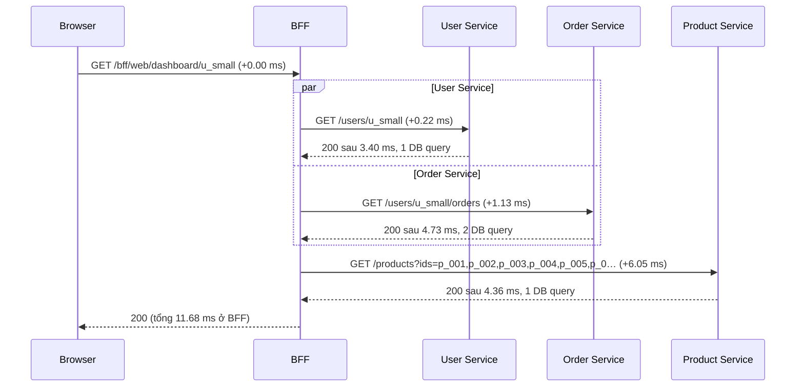
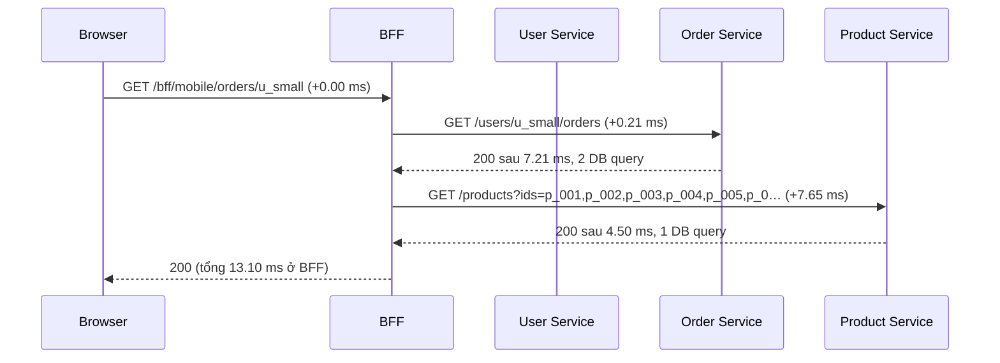

# Call graph nội bộ của BFF

Tự sinh bởi scripts/waterfall.js từ log `logs/measure-2026-10-08T02-46-33-076Z` (lần warm có t_data gần median, dataset small). Mốc thời gian tính từ lúc BFF nhận request.

## BFF web (rid `aed81c9a-fa24-4933-aa7f-f17b89a14133`, t_data 51 ms)

| t (ms) | service | sự kiện | chi tiết | thời lượng (ms) |
|---|---|---|---|---|
| +0.00 | bff | http-in | /bff/web/dashboard/u_small |  |
| +0.22 | bff | http-out | /users/u_small | 3.40 |
| +1.13 | bff | http-out | /users/u_small/orders | 4.73 |
| +1.78 | user | http-in | /users/u_small |  |
| +2.15 | user | db | SELECT id, name, email, avatar_url AS avatarUrl FROM users WHERE id = 'u_small' |  |
| +2.32 | order | http-in | /users/u_small/orders |  |
| +2.63 | order | db | SELECT id, user_id AS userId, status, total_amount AS totalAmount, shipping_add… |  |
| +3.48 | user | http-done | /users/u_small | 1.73 |
| +3.50 | order | db | SELECT order_id AS orderId, line_no AS lineNo, product_id AS productId, quantity … |  |
| +5.39 | order | http-done | /users/u_small/orders | 3.09 |
| +6.05 | bff | http-out | /products?ids=p_001,p_002,p_003,p_004,p_005,p_006 | 4.36 |
| +7.28 | product | http-in | /products?ids=p_001,p_002,p_003,p_004,p_005,p_006 |  |
| +7.83 | product | db | SELECT id, name, price, thumbnail_url AS thumbnailUrl, category, description FROM product… |  |
| +9.65 | product | http-done | /products?ids=p_001,p_002,p_003,p_004,p_005,p_006 | 2.38 |
| +11.66 | bff | http-done | /bff/web/dashboard/u_small | 11.68 |

## BFF mobile (rid `9aed20b7-058c-41f9-9ff8-1a96b78e6cbc`, t_data 40.1 ms)

| t (ms) | service | sự kiện | chi tiết | thời lượng (ms) |
|---|---|---|---|---|
| +0.00 | bff | http-in | /bff/mobile/orders/u_small |  |
| +0.21 | bff | http-out | /users/u_small/orders | 7.21 |
| +2.04 | order | http-in | /users/u_small/orders |  |
| +2.29 | order | db | SELECT id, user_id AS userId, status, total_amount AS totalAmount, shipping_add… |  |
| +3.24 | order | db | SELECT order_id AS orderId, line_no AS lineNo, product_id AS productId, quantity … |  |
| +5.47 | order | http-done | /users/u_small/orders | 3.45 |
| +7.65 | bff | http-out | /products?ids=p_001,p_002,p_003,p_004,p_005,p_006 | 4.50 |
| +8.55 | product | http-in | /products?ids=p_001,p_002,p_003,p_004,p_005,p_006 |  |
| +8.99 | product | db | SELECT id, name, price, thumbnail_url AS thumbnailUrl, category, description FROM product… |  |
| +10.62 | product | http-done | /products?ids=p_001,p_002,p_003,p_004,p_005,p_006 | 2.08 |
| +13.08 | bff | http-done | /bff/mobile/orders/u_small | 13.10 |

