# Waterfall (tự sinh bởi scripts/waterfall.js)

Phiên đo: 2026-10-08T02:46:33.555Z. Mỗi hình là lần warm có t_data gần median nhất của nhóm.

## localhost

### baseline · web

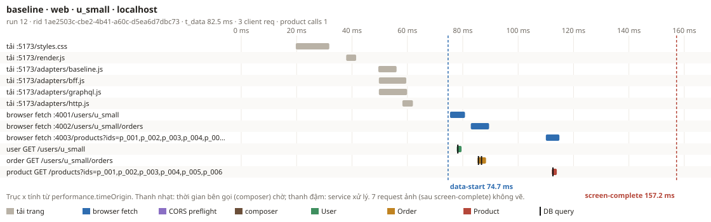

### bff · web

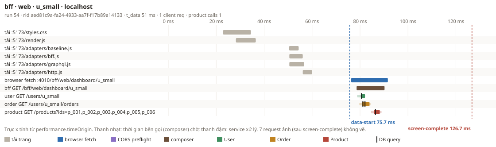

### bff · mobile

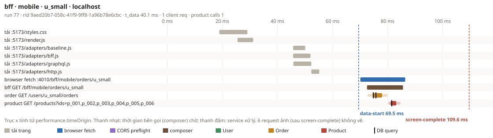

### gql-naive · web

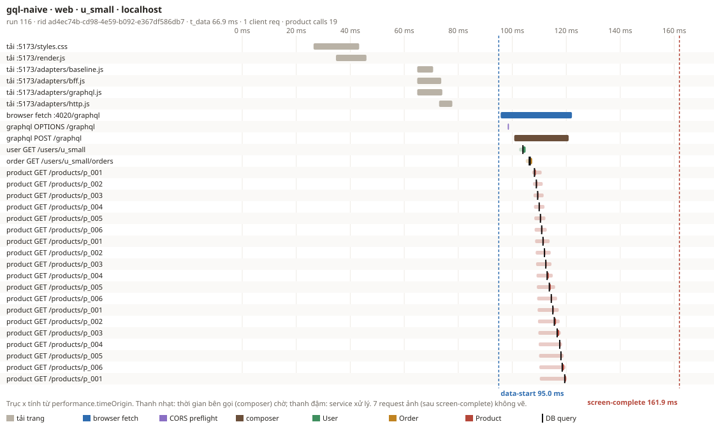

### gql-naive · mobile

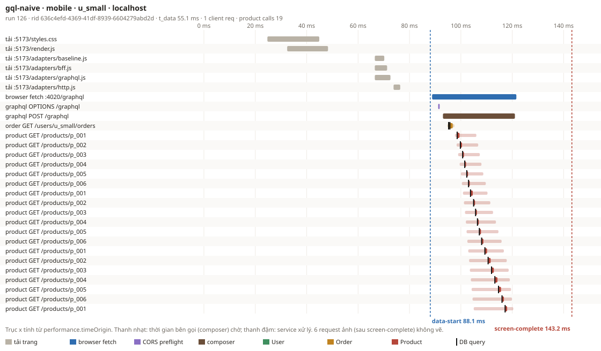

### gql-batched · web

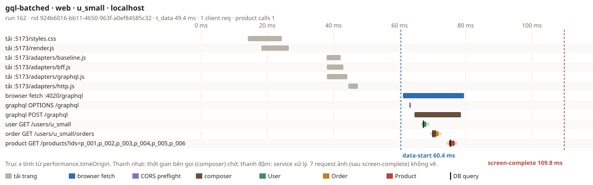

### gql-batched · mobile

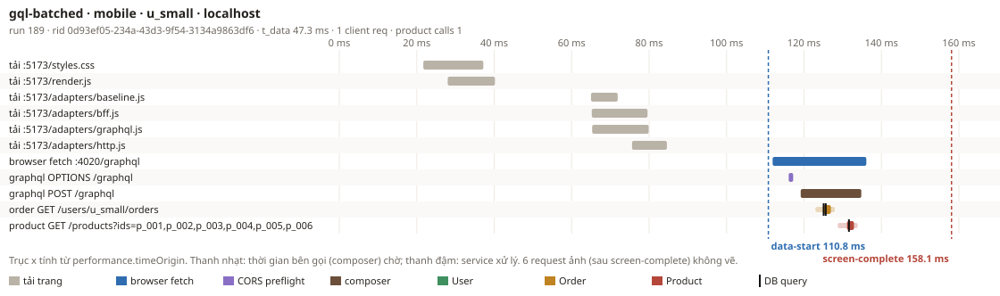

## throttle RTT +100 ms

### baseline · web

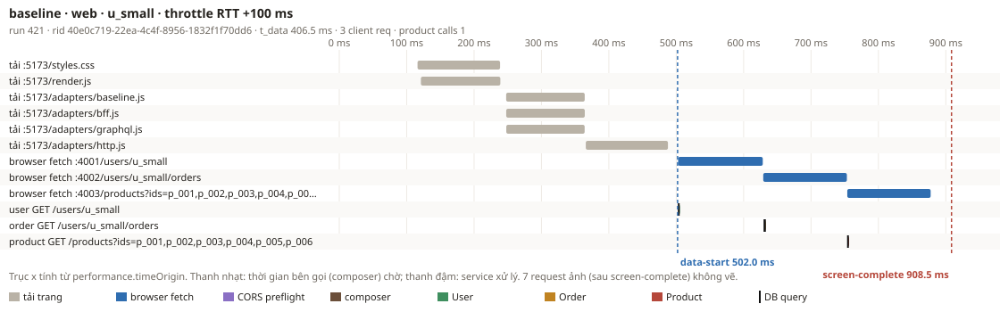

### bff · web

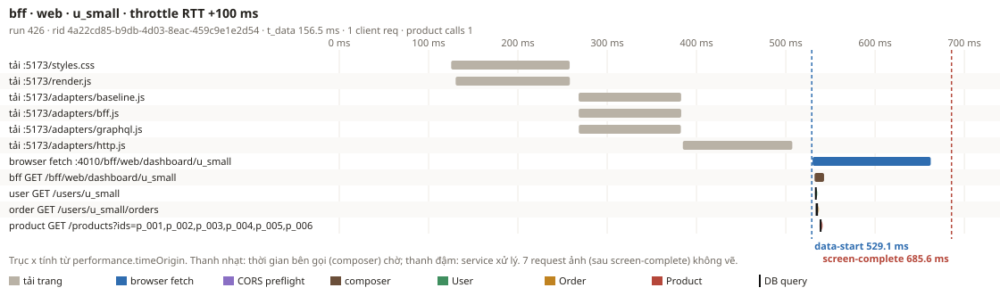

### bff · mobile

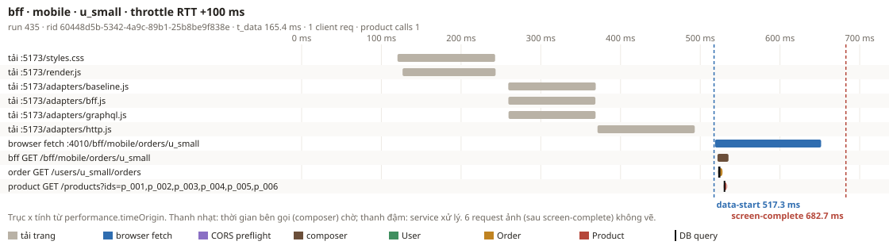

### gql-naive · web

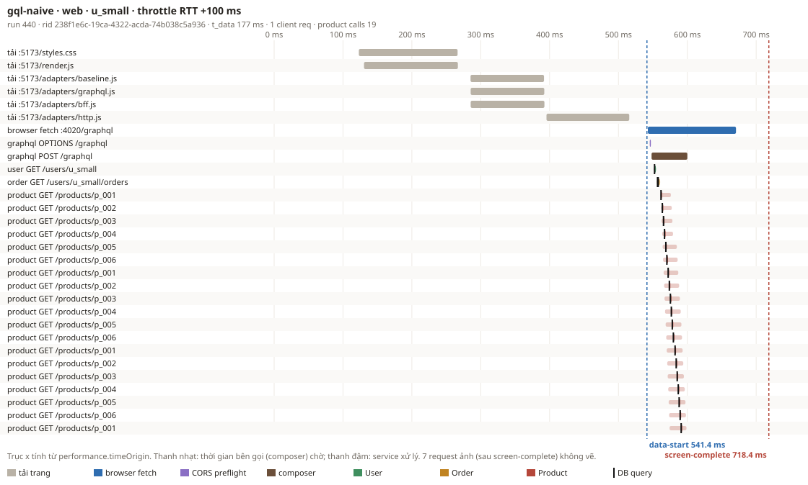

### gql-naive · mobile

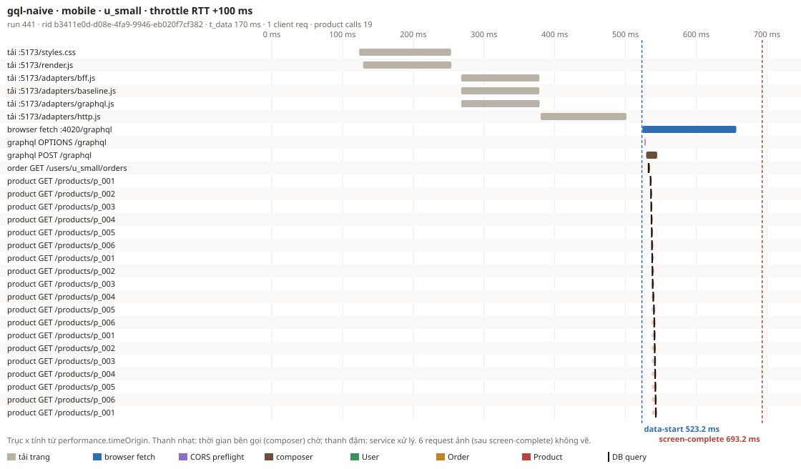

### gql-batched · web

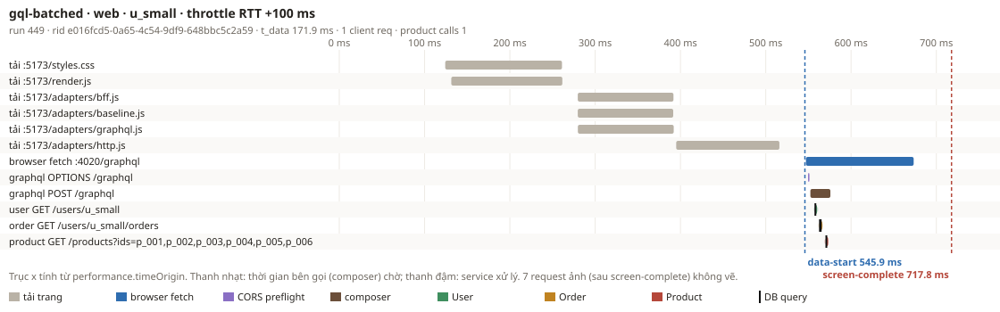

### gql-batched · mobile

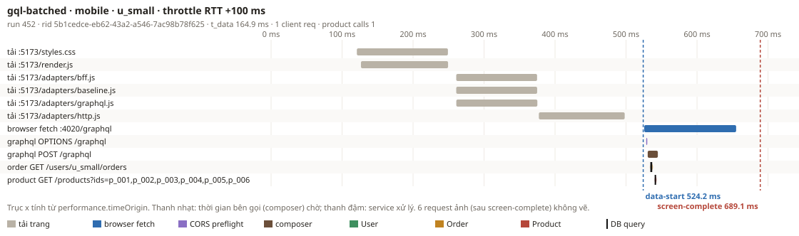

## Product treo (timeout 1000 ms)

### bff · web

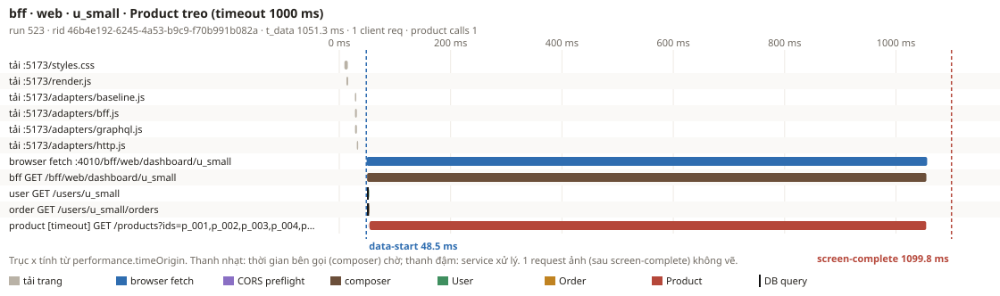

### bff · mobile

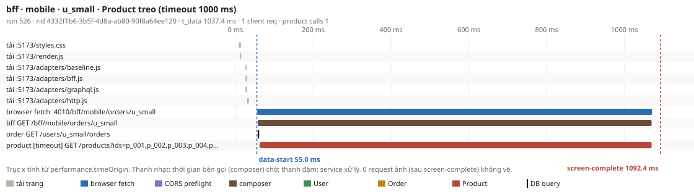

### gql-batched · web

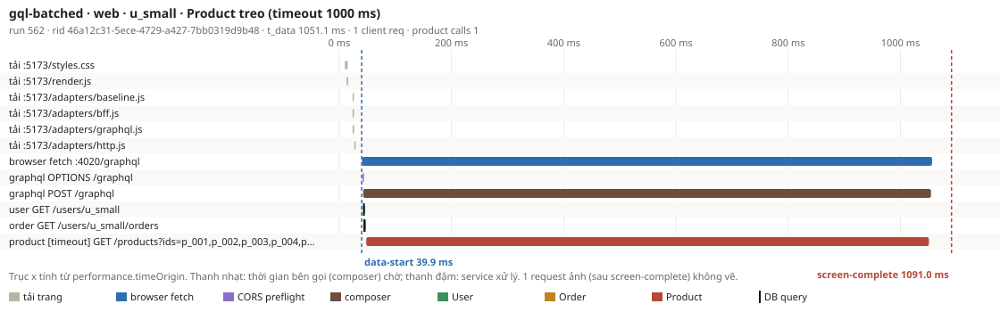

### gql-batched · mobile

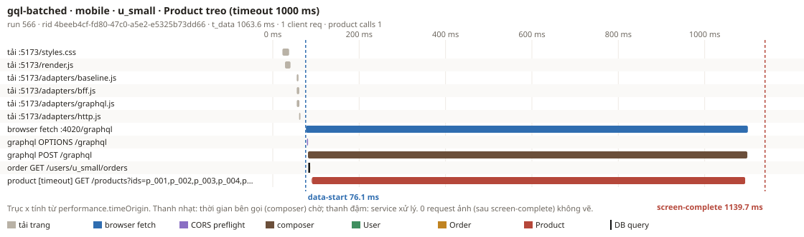

